# EVIDENCE.md

Proof for each requirement in the Definition of Done (brief §6) and the six acceptance probes (brief §12). Each item shows what it proves, the command used, and the result.

Screenshots are in `evidence_pictures/`.

---

## 1. AI Processing

### 1.1 Vision output is validated, bad output is rejected

**Proves:** the model's output is checked against a schema before it's trusted. Bad category, bad confidence value, missing fields, and broken JSON are all caught.

**Command:**
```
pytest tests/test_schemas.py -v
```

**Result:** 6 out of 6 tests passed.

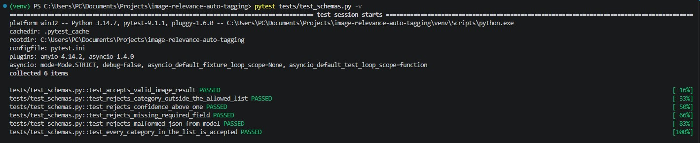

---

### 1.2 Low-confidence images are flagged, not accepted

**Proves:** any image the model isn't sure about goes to human review instead of being treated as normal.

**Command:**
```sql
SELECT status, COUNT(*) FROM Images GROUP BY status;
```
**Result:** 49 images done, 1 image flagged.

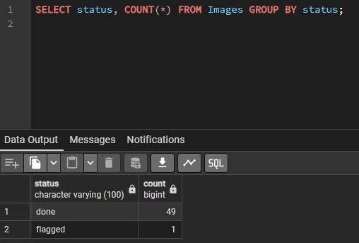

**Command:**
```sql
SELECT imageID, subject, category, confidence, status FROM Images WHERE status = 'flagged';
```
**Result:** image 13, confidence 0.65, below the 0.75 cutoff, correctly flagged.

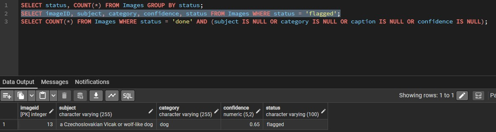

---

### 1.3 Images are processed as a batch job with retries

**Proves:** vision calls run as a background job, and a failed call is retried instead of dropped.

**Where to check:** `scripts/find_pending_images.py`. Each image gets up to 3 attempts with a 4 second wait between tries. An image only gets marked failed once all 3 attempts fail.

---

### 1.4 Every call is cost-tracked

**Proves:** every vision call has its token usage logged.

**Command:**
```sql
SELECT purpose, COUNT(*), SUM(totalTokens) FROM api_calls GROUP BY purpose;
```
**Result:** 50 vision calls logged, 84,179 total tokens.

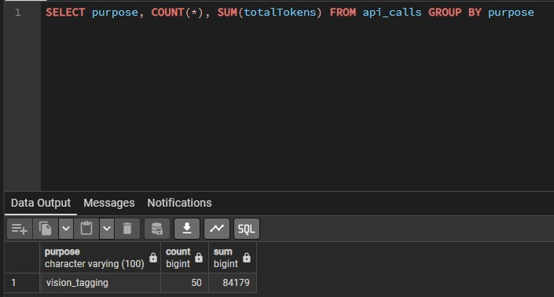

**Known limitation:** embedding calls are not cost-logged. The embedding API does not return usage data in this SDK version, confirmed by direct inspection. This is explained in BUILDLOG.md.

---

## 2. Matching System

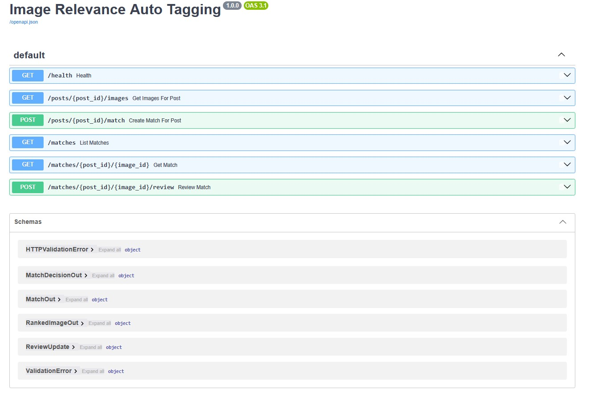

### 2.1 Posts return ranked image suggestions

**Proves:** given a post, the system returns images ranked from most to least relevant.

**Command:**
```
GET /posts/1/images?limit=5
```

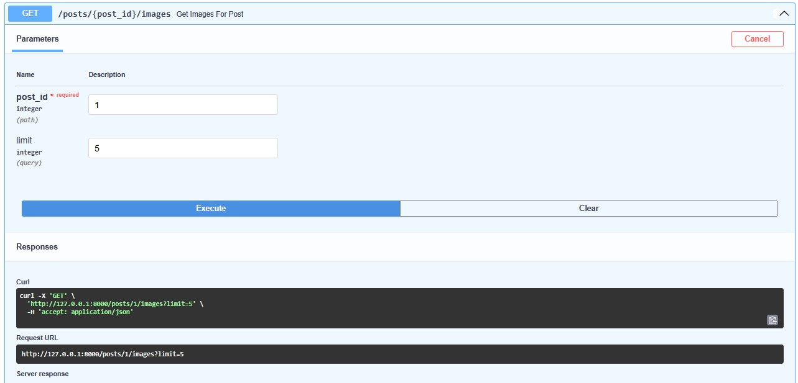

**Result:** top image is a fox (distance 0.239), followed by 4 more fox images in increasing distance order.

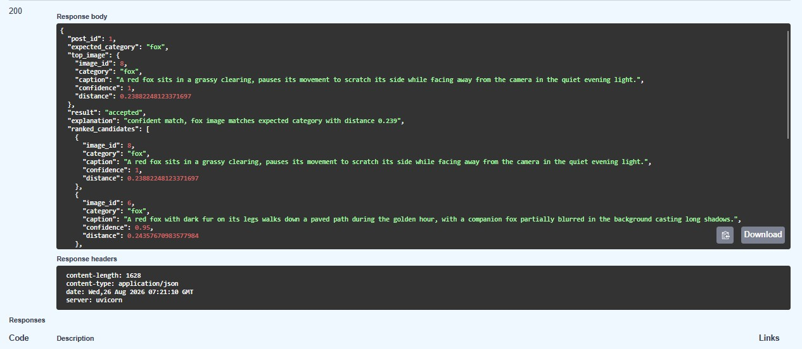

---

### 2.2 Matching works on meaning, not shared words

**Proves:** the system matches by concept, not by keyword overlap.

**Command:**
```
python -m scripts.semantic_test
```
**Query used:** "Vulpes vulpes, the scientific name for a common wild canid found across the northern hemisphere." This sentence shares no words with any fox caption in the database.

**Result:** all 5 closest images are fox images.

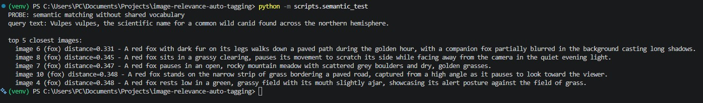

---

### 2.3 Probe 2: fox post ranks fox images first

**Proves:** ranking correctly separates categories.

**Result:** same as 2.1 above. Every one of the top 5 images for the fox post is a fox, none are wolf or dog.

---

### 2.4 Probe 3: a wrong image is rejected even when close in distance

**Proves:** the guard checks category, not just distance. A wolf close enough to pass the distance check still gets refused.

**Command:**
```
python -m scripts.forced_wolf
```
**Result:** wolf image distance 0.359 (within the 0.45 limit), but rejected for category mismatch.

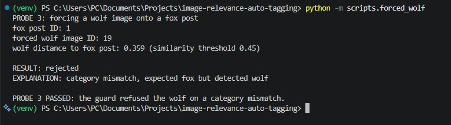

---

### 2.5 Rejections explain themselves

**Proves:** every refusal comes with a plain reason, not just a yes/no.

**Examples from the system:**
- "category mismatch, expected fox but detected wolf"
- "low confidence, image tag confidence 0.65 is below threshold 0.75"
- "no confident match, closest image distance 0.452 is above threshold 0.45"

---

### 2.6 Probe 4: no good image means no guess

**Proves:** when nothing is a good enough match, the system says so instead of picking anyway.

**Command:**
```
python -m scripts.run_guard
```
**Result:** post 9 rejected, closest image distance 0.452 is above the 0.45 limit.

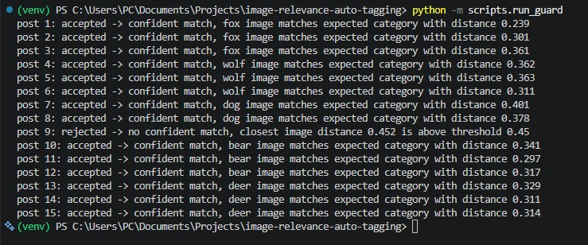

---

## 3. Backend

### 3.1 Database has the needed indexes

**Proves:** the columns the system actually searches on are indexed.

**Command:**
```sql
SELECT indexname, tablename FROM pg_indexes WHERE schemaname = 'public' ORDER BY tablename, indexname;
```

| Table | Indexes added |
|---|---|
| images | status, category |
| posts | expectedCategory |
| matches | postID, reviewStatus |
| api_calls | purpose |

No index was added on the embedding columns. At 50 rows a full scan is instant, and an approximate index can actually reduce accuracy at this size. Explained further in README.

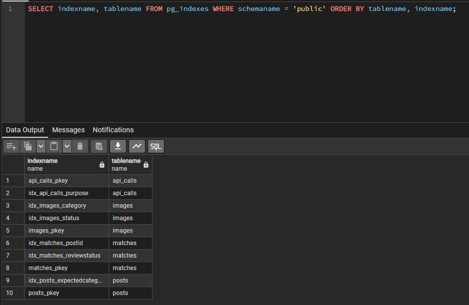

---

### 3.2 Review API works correctly

**Proves:** matches can be approved or rejected, and bad input cannot corrupt the data.

**Approving a match:**
```
POST /matches/1/8/review
Body: {"review_status": "approved"}
```

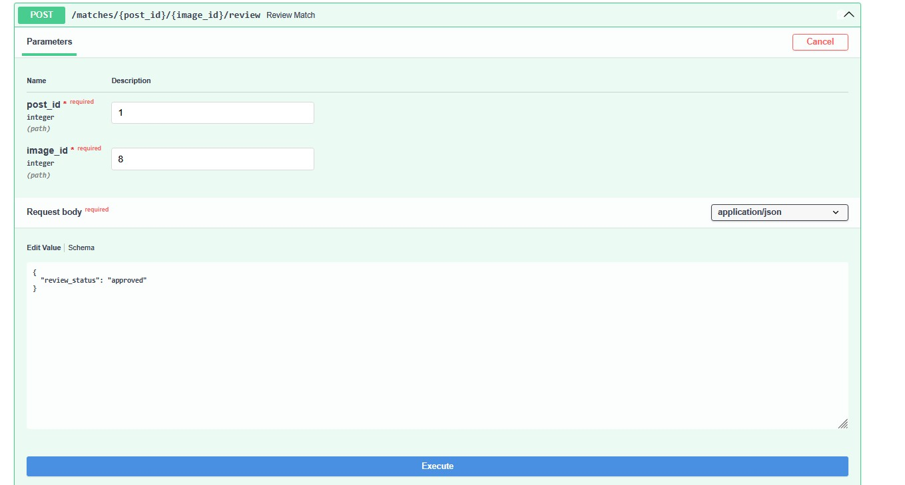
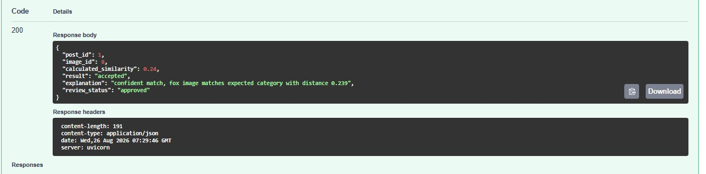

**Sending an invalid value:**
```
POST /matches/1/8/review
Body: {"review_status": "maybe"}
```
**Result:** rejected with a 422 error. The match's real status is unaffected.

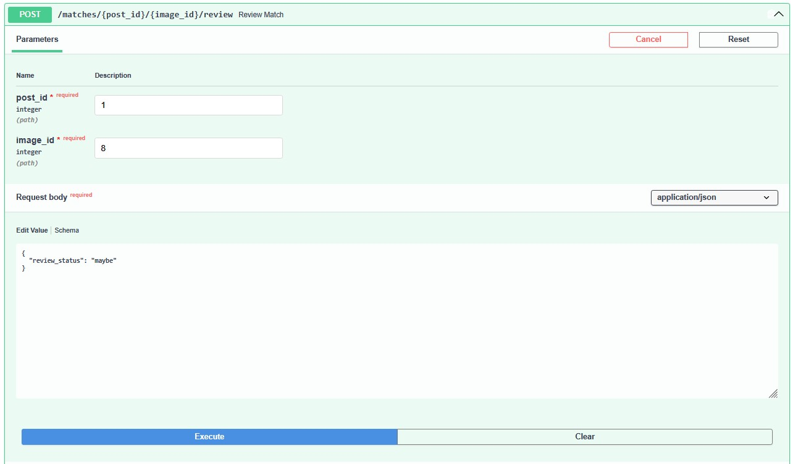
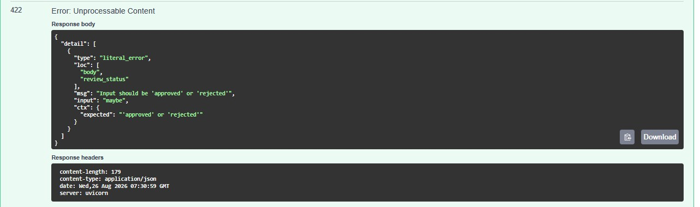

---

### 3.3 Automated tests pass

**Proves:** schema checks, guard logic, and the API all work as intended, checked automatically.

**Command:**
```
pytest tests/ -v
```
**Result:** 24 out of 24 tests passed.
- 6 tests on the guard's gate logic, including gate order
- 6 tests on schema validation
- 12 tests on the API endpoints

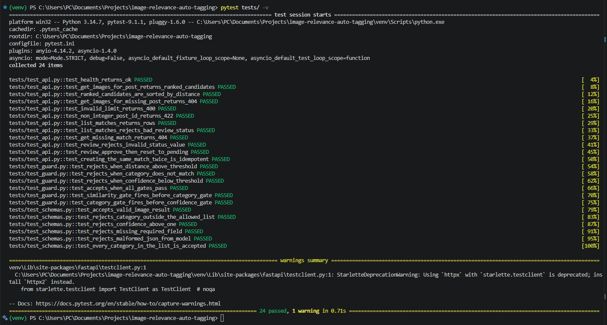

---

## 4. Quality & Documentation

### 4.1 Probe 5: measured accuracy against real answers

**Proves:** match quality is measured, not just claimed.

**Eval set:** `eval_set.json`, 15 posts each paired with a hand-picked correct image, chosen by looking at the actual photos, not by copying what the guard already picked.

**Command:**
```
python -m scripts.run_eval
```
**Result:**
- Exact photo match: 1 out of 15 (6.67%)
- Correct animal category: 15 out of 15 (100%)

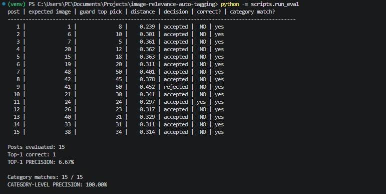

**Why two numbers:** blog posts describe topics ("wolf pack dynamics"), while photo captions describe specific scenes ("two wolves, one blurred in the background"). These rarely use the same words, even when the match is correct. Category accuracy reflects what the guard actually promises: the right animal, every time.

---

### 4.2 Data is clean

**Proves:** the matches table has exactly one row per post, no leftover duplicates from testing.

**Command:**
```sql
SELECT COUNT(*) FROM Matches;
```
**Result:** 15.

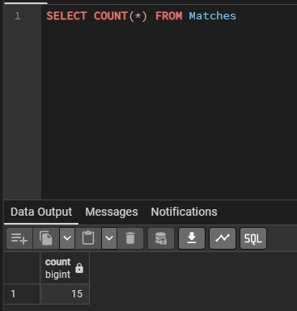